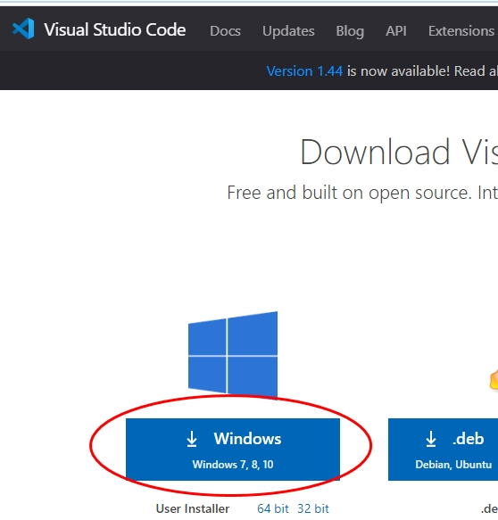
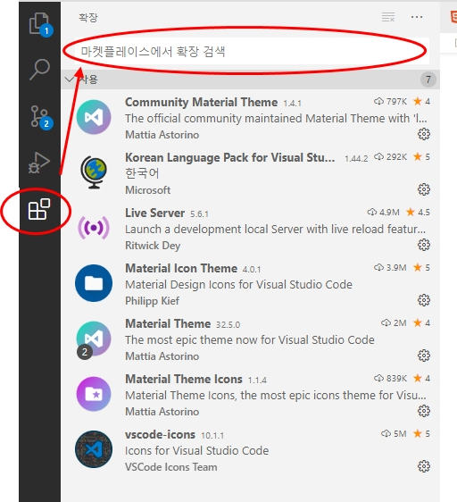
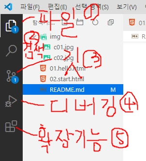
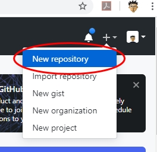
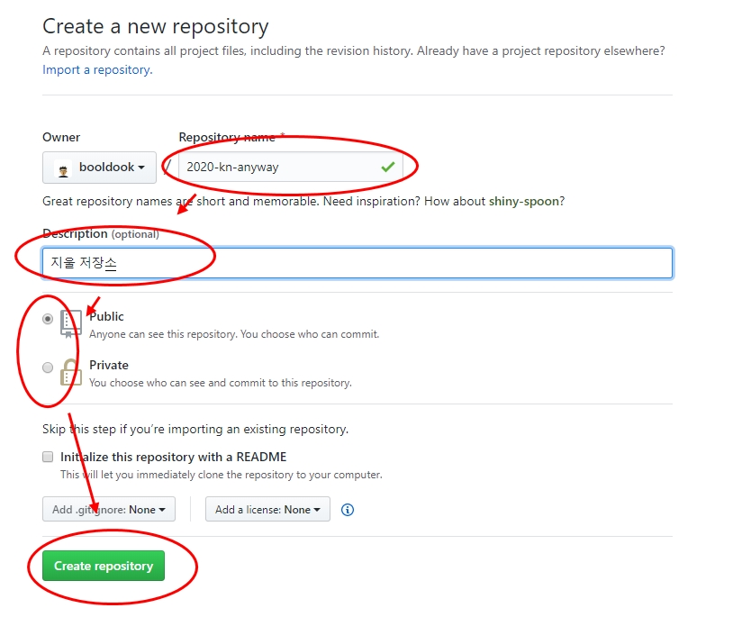
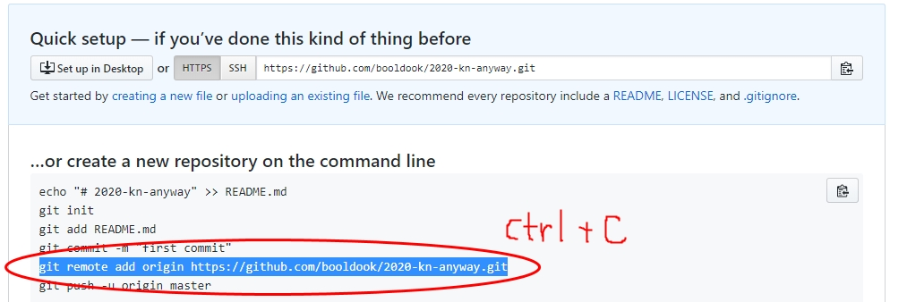
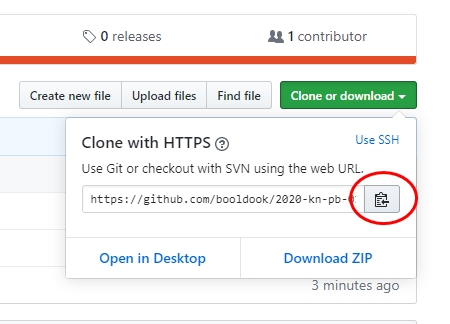
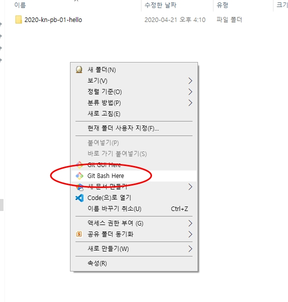

# git을 배워보자
## git 설치
### 1. [git-scm.com](https://git-scm.com) 이동하여 우측 중앙의 다운로드 버튼을 클릭하고 설치한다(기본값으로 설치)
### 2. [github.com](https://github.com) 으로 이동한다.
### 3. 우측 상단의 **signup** 버튼을 클릭한다.
### 4. 회원 가입을 완료하고 등록한 이메일로 이동하여 velified 버튼을 클릭하여 인증한다. 

# visual studio code (VSCode)를 설치하자
## 다운로드
### 1. 구글에서 그림과 같이 검색해서 이동한다.


---

### [vscode](https://code.visualstudio.com/download) 에서 그림과같이 다운로드 한다.


### vscode 설치시 모든옵션을 키고 설치한다.

### 확장기능(Extension third-party plugin)을 설치한다.




# 프로젝트 시작
## 1. vscode 에서 작업
1. 작업폴더로 이동하여 새폴더를 01.hello 생성한다
2. vscode를 열고 **파일 > 폴더 열기...**로 폴더를 연다.
3.  화면의 1번 아이콘 클릭 후 오른쪽버튼(Context Menu)에서 새파일을 선택하여 index.html을 만든다.
4. 아래의 코드를 입력한다.
```html
<!DOCTYPE html>
<html lang="en">
	<head>
		<meta charset="UTF-8">
		<meta name="viewport" content="width=device-width, initial-scale=1.0">
		<title>Hello World</title>
	</head>
	<body>
		<h1>안녕하세요.</h1>
		<h2>반갑습니다.</h2>
		<a href="//naver.com">네이버</a>
	</body>
</html>
```

## 2. github.com 에서의 작업
1. [깃허브](https://github.com)로 이동하여 **로그인**한다.
2. 아래의 그림과 같이 새로운 **repository**를 생성한다.



3. 아래의 사항을 입력하여 **저장소(repository)**를 생성한다.



4. 아래의 화면에서 **제일 긴 줄**을 복사한다.



5. ** 각 컴퓨터에서 한번만 수행할 작업**
```bash
git config --global user.name "booldook"
git config --global user.email "booldook@gmail.com"
```

## 3. 다시 vscode 작업
1.  ```ctrl+j``` 터미널 창을 연다.
2. git을 초기화한다.
```bash
# git 초기화
git init
```

3. github 연결
```bash
# 2-4에서 복사한 내용을 붙이고 실행한다.
git remote add origin https://github.com/booldook/repo
```

4. git에 commit 및 push


- 위의 그림에서 3번 아이콘을 클릭하여 **빈 창에 설명을 쓰고** ```ctrl + enter``` 로 commit한다.
- ```...```을 클릭하고 푸쉬를 선택하여 github에 업로드 한다.


## 4. 다른사람의 git에서 가져오기
1. 가져오고 싶은 github의 저장소로 이동한다.
- 예: https://github.com/booldook/2020-kn-pb-01.hello
2. 아래의 그림처럼 repository 주소를 복사한다.



3. 적절한 폴더에서 아래의 그림처럼 bash창을 연다.



4. bash창에서 아래의 코드를 입력한다.
```bash
git clone https://github.com/booldook/2020-kn-pb-01.hello
```

5. vscode에서 클론된 폴더를 열고 원격저장소의 변경사항이 발생하면 3번아이콘의 ```...```을 클릭하여 pull명령을 실행하여 최신사항을 가져온다.


# VSCode 단축키
## **ctrl + ,** : 환경설정 열고 닫기
## **ctrl + j** : 터미널창 열고 닫기
## **ctrl + /** : 한줄 주석 달기/벗기기
## **ctrl + b** : 왼쪽 창 열고 닫기
## **alt + shift + 아래화살표** : 선택된 행 복사
## **alt + 아래(위)화살표** : 선택된 행 이동
## **alt + click** : 다중 편집 선택 

